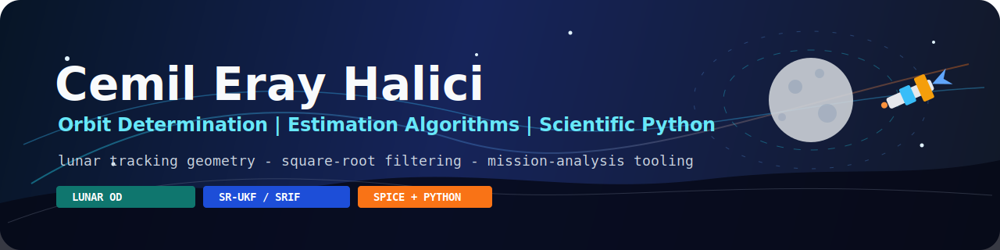
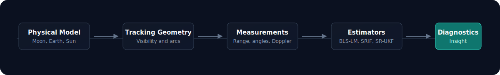

  

  
  
  

  <strong>Orbit Determination | Estimation Algorithms | Scientific Python | Mission-Analysis Tooling</strong>

---

## Mission Brief

I build research-oriented software for spacecraft orbit determination and
mission-analysis workflows. My current work focuses on lunar orbit
determination: propagating trajectories, modeling ground-station visibility,
generating synthetic tracking measurements, and comparing batch and sequential
estimators under sparse observation conditions.

The core idea behind my work is straightforward: start from a physically
meaningful model, make it computationally testable, and turn estimation results
into readable engineering insight.

<table>
  <tr>
    <td width="33%">
      <h3>Orbit Determination</h3>
      
Moon-centered propagation, tracking geometry, visibility arcs, and
      estimator performance analysis.

    </td>
    <td width="33%">
      <h3>Estimation Methods</h3>
      
Batch least squares, SRIF, square-root UKF, covariance consistency,
      and Monte Carlo evaluation.

    </td>
    <td width="33%">
      <h3>Scientific Tooling</h3>
      
Reproducible Python experiments, diagnostics, plotting, and PyQt5
      desktop interfaces for local analysis.

    </td>
  </tr>
</table>

## Research Flow

  

## Featured Work

<table>
  <tr>
    <td width="50%">
      <h3>
        <a href="https://github.com/halici21/lunar-orbit-determination">
          Lunar Orbit Determination Framework
        </a>
      </h3>
      

        Python research framework and PyQt5 desktop application for comparing
        BLS-LM, SRIF, and SR-UKF estimators in lunar tracking scenarios.
      

      

        
        
        
        
      

    </td>
    <td width="50%">
      <h3>Measurement and Visibility Studies</h3>
      

        Synthetic range, angle, range-rate, and counted-Doppler experiments
        with elevation masks, lunar occultation, fragmented arcs, and
        estimator consistency diagnostics.
      

      

        
        
        
      

    </td>
  </tr>
  <tr>
    <td width="50%">
      <h3>Estimator Comparison Pipeline</h3>
      

        Controlled comparison workflow for batch and sequential estimators using
        shared truth trajectories, common measurements, identical noise
        realizations, and reproducible scenario definitions.
      

      

        
        
        
      

    </td>
    <td width="50%">
      <h3>Desktop Mission-Analysis Interface</h3>
      

        Native PyQt5 application for scenario configuration, run monitoring,
        result browsing, estimator comparison, station visibility, and
        diagnostic visualization.
      

      

        
        
        
      

    </td>
  </tr>
</table>

## Engineering Stack

  

  
  
  
  
  

## Public GitHub Snapshot

  
  

## Current Direction

- Improve measurement realism beyond instantaneous synthetic geometry
- Extend radiometric observable modeling and light-time handling
- Strengthen estimator diagnostics under fragmented visibility
- Keep the research code reproducible, tested, and readable
- Build local tools that make complex orbit-determination results easier to inspect

## Contact

  

---

  Research-oriented engineering around astrodynamics, estimation, and scientific software.

