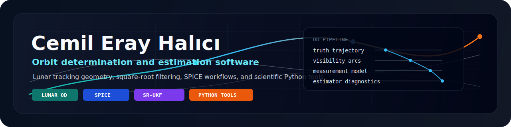

<p align="center">
  
</p>

<h1 align="center">Cemil Eray Halici</h1>

<p align="center">
  <strong>Orbit determination, estimation algorithms, and research-grade scientific Python.</strong>
</p>

<p align="center">
  <a href="https://github.com/halici21/lunar-orbit-determination">
    
  </a>
  
  
  
</p>

---

## What I Work On

I develop computational tools for spacecraft navigation research. My current
work is centered on **lunar orbit determination**: trajectory propagation,
ground-station visibility, synthetic tracking measurements, estimator
diagnostics, and reproducible comparison campaigns.

The technical emphasis is not only on getting an estimate, but on understanding
**why** an estimator succeeds or fails under sparse geometry, interrupted
tracking, nonlinear dynamics, and imperfect measurement information.

## Active Repository

### [lunar-orbit-determination](https://github.com/halici21/lunar-orbit-determination)

A Python framework and native PyQt5 desktop application for lunar orbit
determination experiments.

| Layer | What it contains |
| --- | --- |
| Dynamics | Moon-centered propagation, third-body perturbations, STM integration |
| Geometry | SPICE frames, Earth-fixed stations, elevation masks, lunar occultation |
| Measurements | Range, azimuth, elevation, range-rate, simplified counted Doppler |
| Estimation | BLS-LM, SRIF, SR-UKF, covariance and consistency diagnostics |
| Experiments | Monte Carlo, long-duration arcs, fragmented visibility, Doppler cases |
| Interface | Local PyQt5 app for scenario setup, run monitoring, plots, and comparison |

## Technical Map

```text
truth trajectory
      |
      v
visibility + occultation  ->  tracking arcs
      |
      v
synthetic observables     ->  range / angles / range-rate / counted Doppler
      |
      v
estimation pipeline       ->  BLS-LM / SRIF / SR-UKF
      |
      v
diagnostics               ->  error, covariance, NIS, condition number, runtime
```

## Current Engineering Questions

- How do batch and sequential estimators behave when lunar tracking is fragmented?
- When does weak station geometry dominate estimator performance?
- How should synthetic measurements be upgraded from instantaneous geometry to
  light-time-aware observables?
- Which diagnostics best explain estimator failure: residuals, covariance,
  NIS, rank, condition number, or arc structure?
- How can research scripts be packaged into a local tool that is useful for
  scenario design and result inspection?

## Working Stack

| Area | Tools |
| --- | --- |
| Scientific Python | NumPy, SciPy, pandas, Matplotlib |
| Astrodynamics | SPICE / spiceypy, reference frames, state propagation |
| Estimation | least squares, square-root information filtering, unscented Kalman filtering |
| Testing | pytest, seeded regression cases, finite-difference checks |
| UI | PyQt5, Qt Designer, local desktop tooling |
| Documentation | Markdown, LaTeX, reproducible experiment outputs |

## Repository Signal

<p align="center">
  
  
</p>

## Direction

My next improvements are focused on measurement realism and estimator
defensibility:

- one-way light-time corrected range / azimuth / elevation observables
- clearer separation between geometric range-rate and counted Doppler
- stronger residual/model consistency checks
- better documentation of model limitations and assumptions
- cleaner public-facing examples for reproducing comparison results

## Contact

<p align="center">
  <a href="https://github.com/halici21">
    
  </a>
</p>

---

<p align="center">
  <sub>Research software for orbit determination, estimator comparison, and lunar tracking analysis.</sub>
</p>
